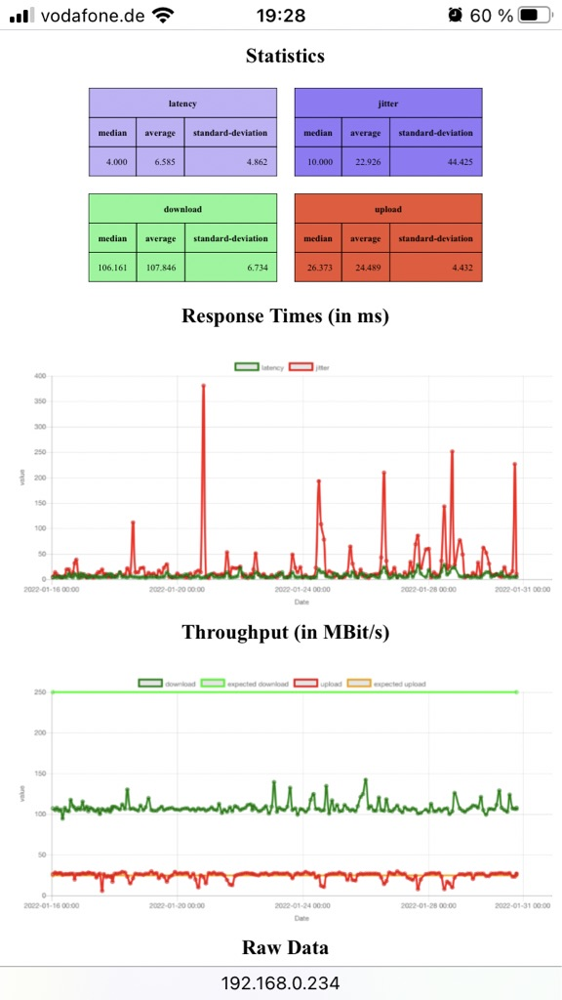
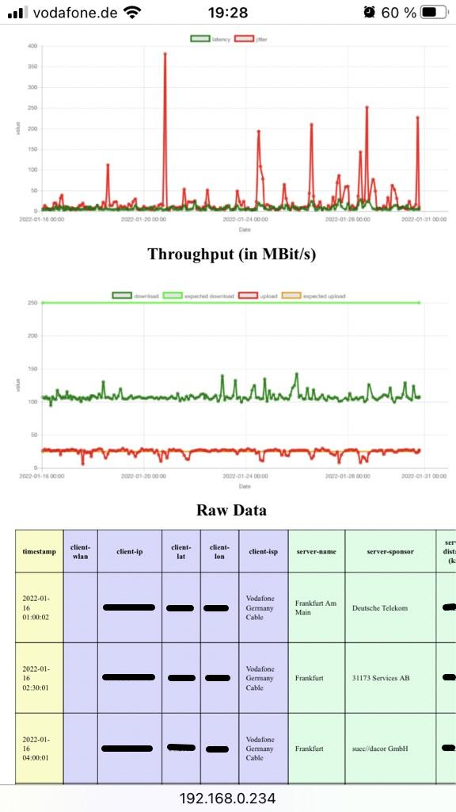

# SpeedTracker

purpose: track and visualize DSL speed over a longer period  (runnable on a Raspberry Pi)

'speedTracker' has two modes:

- a *mode 1* for producing data periodically via a cron job, it will generate the output at a fixed location:

```bash
speedtracker run
```

it does:

1. read config file with following basic information:
    - data_dir     : directory where data is stored
    - output_file  : should be on a path served by a webserver (apache e.g.)
    - output_xdays : number of days in the past (from today) the data should be visualized
    - log_file     : logfile name and location

2. start "speedtestJson" and append its output at the file of the current month in 'data_dir'.
3. read and filter files(s) to get the data of the last 'output_xdays'.
4. transform the data into a self-containing html page at location 'output_file'.


- a *mode 2* to produce a self a self-containing html page at a given location (without calling speedtestJson):

```bash
speedtracker 2022-01-01 2021-12-31 ./index.html
```

note: the purpose of this mode is to visualize historic data from e.g. two month ago. 

it does:

1. parse following parameter from command line by position (as in the example above):
   - output_file
   - from_date
   - to_date

2. read config file to get 'data_dir'.
3. read and filter files(s) to get the data of the dates 'from_date' - 'to_date'
4. transform the data into a self-containing html page at location 'output_file' (given as command parameter).

## Screen shots






## Required Software:

 - package wireless-tools.dep  (iwgetid)  (if the WLAN SSID should be in the output)
 - requirements from SpeedTest (see README.md of linked SpeedTest)
 - any webserver to serve static data

## Install on a Raspberry Pi

0. Ensure that you cloned this repository including submodules
1. install rust & compile speedtracker 
```bash
curl --proto '=https' --tlsv1.2 -sSf https://sh.rustup.rs | sh
cargo build --release
```
2. install speedtracker (see README.md of linked SpeedTest)
3. copy "target/release/speedtracker" and "SpeedTest/speedtestJson" into one new directory e.g. "/opt/speedtracker"
4. copy "pi_files" into "/opt/speedtracker"
5. create a cronjob for speedtracker via 'crontab -e' e.g.:
```bash
#run every two hours
0 */2 * * * /root/speedtracker run
```
7. install a webserver e.g. apache
```bash
sudo apt-get install apache
```
8. modify /speedtracker.toml, interesting settings are:
```bash
data_dir = './'  <- your data files are stored here, best practice not on the sdcard but on a usb thumb drive 
output_file = '/var/www/html/index.html',  <- your output file must be served by the webserver, so pick a directory that is served
output_xdays = 14   <- numbers of days in the past you are intersted in (can be changed anytime, no data is deleted)
log_file = './speedtracker.log'  <- location where your log file is stored

[download_chart.expected_value]
value = 250.0   <- your expected download speed, it is in Mbits/s (only used to display a baseline)

[upload_chart.expected_value]
value = 25.0    <- your expected upload speed, it is in Mbits/s (only used to display a baseline)
```
9. ensure that all file locations you specified above are writable
10. enjoy and wait for your collected data

## Install with Docker 

If you do not want to run SpeedTracker on a Raspberry Pi but on a NAS, you can use docker.
Settings you might want to change are in directory  [./docker_files](./docker_files).
(see Install on a Raspberry Pi).  

### Build & Run:

Either build it yourself via:

```bash
docker build . --tag speedtracker:0.1.0 
docker run -dit --name mySpeedTracker -p 8080:80 speedtracker:0.1.0
```

or pull the ready to run container from dockerhub:

### Pull & Run:

```bash
docker pull fmantz/speedtracker
docker run -dit --name mySpeedTracker -p 8080:80 fmantz/speedtracker
```

## License

SpeedTracker is available as open source program under the terms of the [MIT License](./LICENSE).